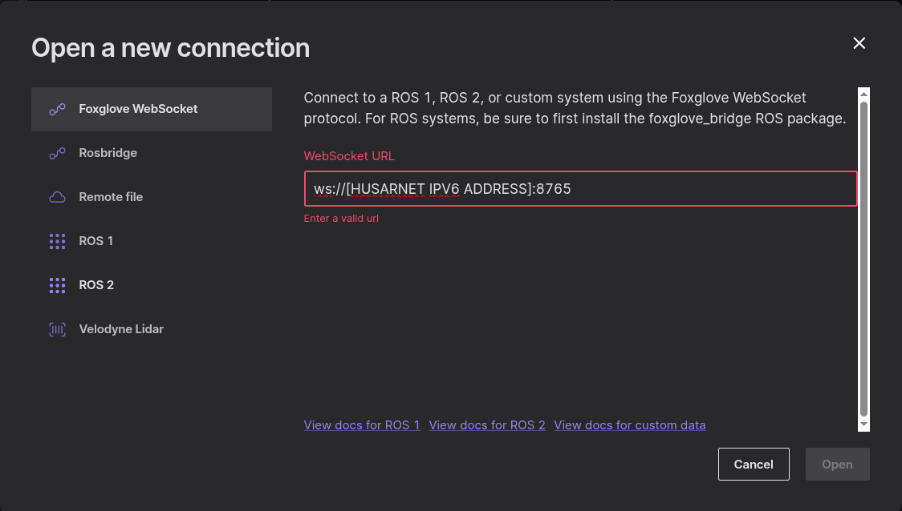
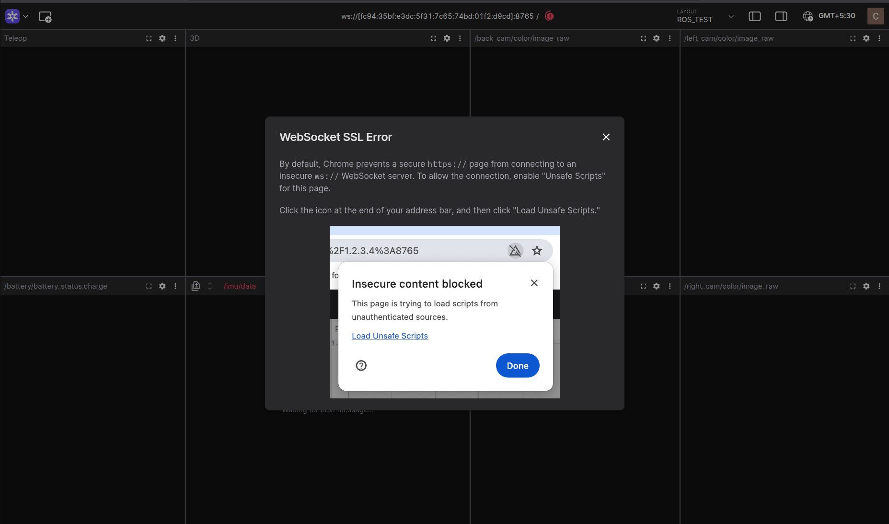
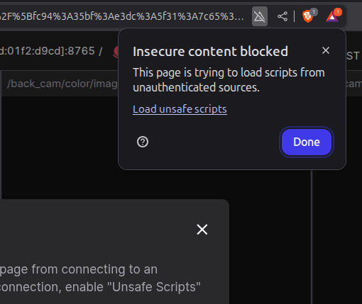
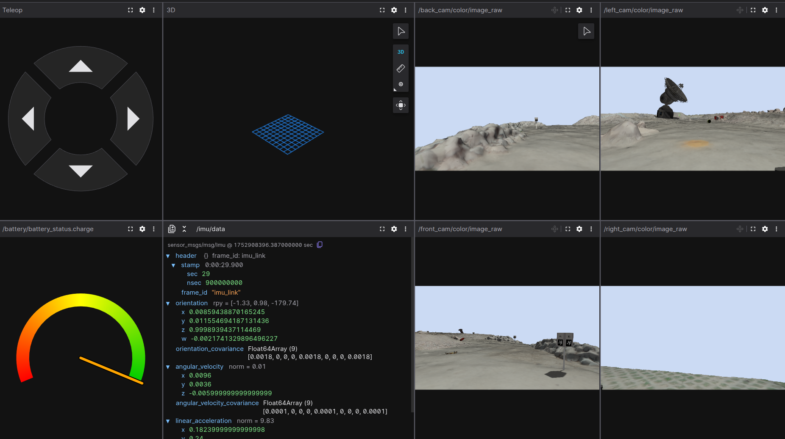
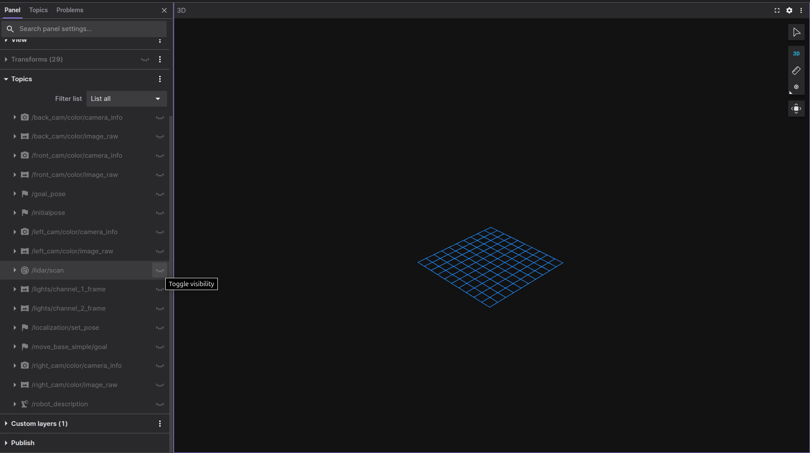
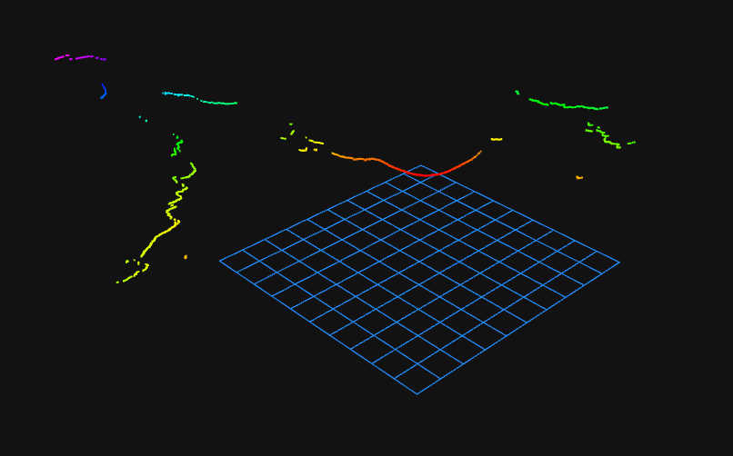
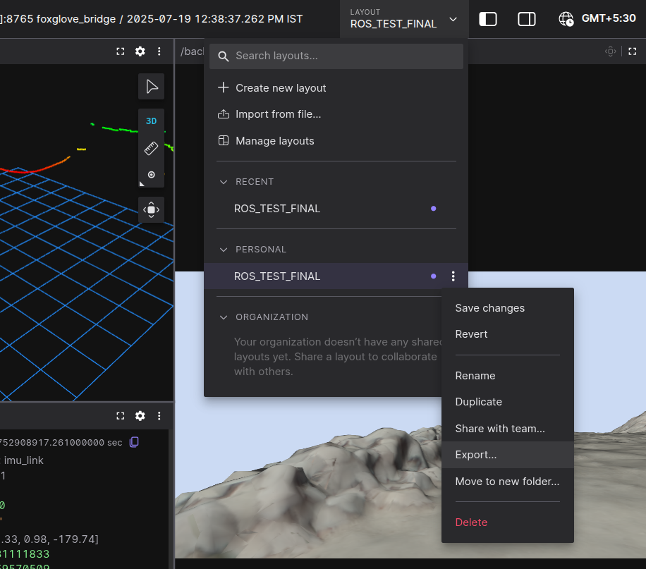

# erc2025-foxglove-setup-guide (by Team SHUNYA)
---

# Foxglove Bridge Setup Guide (with Husarnet IPv6 Support)

After connecting with other teams, we learned that many—ourselves included—faced issues launching Foxglove using IPv6 or the Husarnet peer address. To help others avoid these problems, we're creating this guide with the future in mind, so it can serve as a **universal setup reference** for anyone facing similar challenges.

---

## 🚀 Installation [in VM]

Install the Foxglove bridge for your ROS 2 distribution:

```bash
sudo apt install ros-$ROS_DISTRO-foxglove-bridge
````


## 🔧 Launching the Bridge [in VM]

If you're experiencing issues connecting to the bridge via IPv6, try explicitly setting the `address` parameter(you can get the IPv6 address through `sudo husarnet status` command):

```bash
ros2 launch foxglove_bridge foxglove_bridge_launch.xml address:="'::'"
```

---

## 🌐 Recommended Browsers

Brave and Chrome have been tested and confirmed to work well with Foxglove(Scroll down for reference screenshots).

## 🔌 Connecting via Husarnet [in Remote PC]

1. **Choose Connection Type**: Select `Foxglove WebSocket`.

2. **Find Husarnet Peer Address**:

   * Run `husarnet status` or check the [Husarnet Dashboard](https://app.husarnet.com/) to find the IPv6 peer address of the remote device where topics are published.

3. **Connect Using IPv6**:

   * Enter the address in this format:

     ```
     ws://[<HUSARNET_IPV6_ADDRESS>]:8765
     ```
   * Ensure the IPv6 address is enclosed in square brackets `[]`.

4. **Enable Content**:

   * Click **"Load unsafe scripts"** if prompted in the browser.
---









---

## 📊 Choosing Panels for ROS Topics

### Commonly Used Panels for `ROS_TEST` Topics:

* **Raw Messages**
  View raw sensor data like IMU, battery voltage, etc.

* **Gauge**
  Visualize numeric values (e.g., speed, voltage) on customized gauges.

* **Image Panel**
  Stream and view camera feeds.

* **Teleop Panel**
  Control robot movement interactively from the browser.

---


---


* **3D Panel**
  Visualize:

  * 3D LiDAR
  * Depth data
  * Joints
  * Point clouds
    *(Toggle visibility for relevant topics)*

  


  


---

## 🧩 Creating & Managing Layouts

### Creating a Custom Layout

1. Click **"Create New Layout"**.
2. Add your desired panels.
3. Select the relevant topics for each panel.
4. Arrange the layout as you prefer.




### Exporting the Layout

* Use the **"Export"** option to save the layout as a `.json` file to a chosen location.


### Importing the Layout

* Use **"Import from file"** and select your previously saved `.json` layout.
* All topic and panel settings will be restored.

---

## ✅ Summary

This guide helps you:

* Overcome IPv6 connection issues using Husarnet with Foxglove.
* Properly visualize ROS 2 topics including LiDAR, images, sensor data, and control interfaces.
* Save and reuse customized layouts for quicker setup in future sessions.
